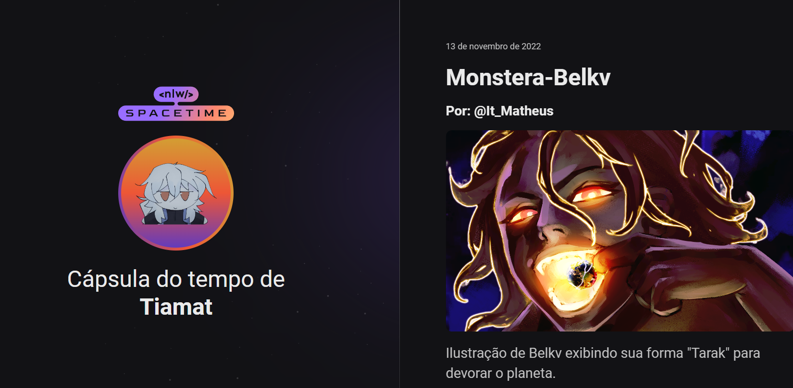

## 🖥️ Projeto
Esse é um projeto Web Responsivo de uma galeria para exibir os desenhos feitos sobre a história em ordem cronológica.

## 🚀 Tecnologias
Esse projeto foi desenvolvido durante o NLW da Rocketseat com as seguintes tecnologias:

-HTML
-CSS
-GIT e Github

